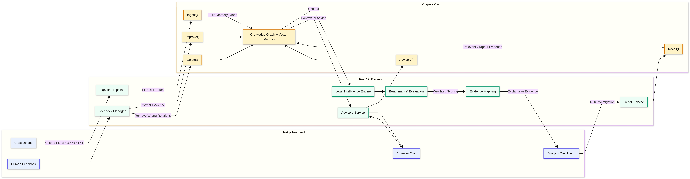
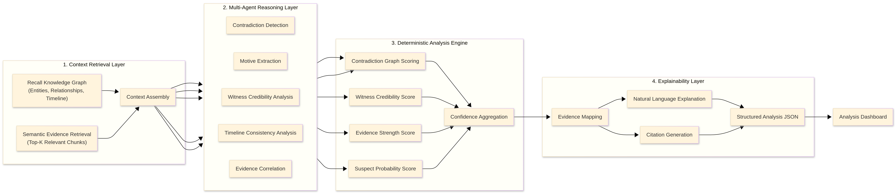
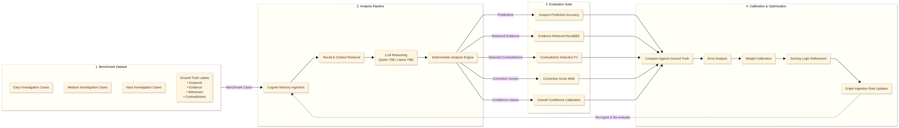

# CogniVerdict Legal Reasoning Engine

CogniVerdict is an advanced legal intelligence and analytics platform designed to analyze complex case documents, perform entity-relationship mapping on a knowledge graph, detect contradictions and biases, and dynamically compute prosecution strength and case-agnostic conviction probabilities.

The platform provides a complete end-to-end pipeline—from raw case text ingestion to interactive graph visualization, conversational legal advisory, expert feedback calibration, and automated benchmarking against ground-truth legal metrics.

---

## System Architecture & Data Flow

Below is the conceptual flow of the CogniVerdict pipeline:



---

## Key Core Components

### 1. Data Ingestion & Cloud Graph Construction (Cognee Cloud)
- **Document Chunking**: Raw case documents (PDFs, text files, JSON dossiers) are uploaded and segmented into semantic chunks.
- **Entity & Relation Extraction**: CogniVerdict calls the **Cognee Cloud REST API** to extract nodes (suspects, victims, witnesses, physical evidence, digital logs) and construct directed edges representing legal relationships.
- **UUID to Name Resolution**: Because graph databases internally identify nodes by database UUIDs, CogniVerdict features a translation layer that dynamically maps UUIDs to human-readable names before feeding relationship contexts to the LLMs. This prevents ID leaks and keeps testimonies readable.

### 2. Case Library
- **Case Selection**: A centralized interface where legal analysts can select from active cases (e.g., `CASE_001` through `CASE_011`).
- **Dynamic Legal Briefs**: Generates three levels of summaries using the NVIDIA LLM API:
  - **Quick Summary**: A concise 150-word overview of the case.
  - **Standard Brief**: A structured 400-word brief highlighting key parties and timelines.
  - **Detailed Brief**: A comprehensive 1000-word analysis with deep breakdowns of evidence, motives, and contradictions.
- **Interactive Graph Visualizer**: A custom D3.js force-directed mindmap showing nodes and relationships directly from Cognee Cloud.

### 3. Analysis Engine & Reasoning Pipeline

CogniVerdict implements a parallelized multi-agent reasoning architecture that evaluates case facts and graph topologies:
- **Parallel LLM Orchestration**: Runs contradiction analysis, motive extraction, and witness bias detection concurrently using Python's `asyncio.gather` pipeline. This architecture reduces processing latency from ~45 seconds to under 15 seconds, preventing cloud load-balancer and gateway timeouts.
- **Explainable Evidence Mapping**: Links raw vector chunks back to the original documents (e.g. `WS-005.json`). When the dashboard displays motive or timeline contradictions, investigators can click to view the actual source text, eliminating opaque "chunk index" references.
- **Core Reasoning Agents**:
  * **Contradiction Detection**: Cross-references timelines, statement changes, and physical logs (e.g. CCTV vs testimony) to flag logical inconsistencies.
  * **Motive Detection**: Deduces driving incentives, emotional drivers, and revenge indicators for each key subject.
  * **Bias & Credibility Extraction**: Detects witness self-interests, coercion flags, and familial relations.

### 4. Advisory Chat
- **Contextual QA**: Allows users to chat with an AI legal assistant regarding the facts of the active case.
- **Semantic Retrieval**: Merges graph entities and relationships with chunk-retrieval vectors to build an augmented LLM context, ensuring answers are grounded directly in the case files.

### 5. Feedback Panel (Expert Overrides)
- **Calibrating the Engine**: Since LLMs can misinterpret legal nuances, the Feedback Panel allows senior human attorneys to override automatic scores and entities.
- **Adjustable Parameters**:
  - Add/modify suspect names.
  - Adjust witness consistency scores (e.g., overriding a witness from `low` to `high` credibility).
  - Add custom evidence weights.
  - Correct contradiction or motive annotations.
- **Real-Time Recalculation**: Adjustments submitted to the panel instantly trigger a recalculation in the scoring pipeline, immediately updating conviction probabilities on the dashboard.

### 6. Scoring Engine & Conviction Accuracy Pipeline
CogniVerdict uses a deterministic scoring engine that processes the LLM-extracted legal signals combined with human feedback.
- **Witness Credibility**: Computes a score based on statement consistency, independence (deducting penalties for biases like familial relations, bribery, or coercion), and any expert overrides.
- **Prosecution Strength**: Calculates a weighted score of all incriminating evidence (factoring in admissibility and witness credibility).
- **Conviction Probability**: Combines prosecution strength with suspect-specific motives and overall case contradictions to produce a final conviction likelihood percentage.

### 7. Benchmarking Layer



To prevent the engine from overfitting to specific cases, CogniVerdict features a continuous evaluation suite that measures performance across multiple test dossiers.

#### How to Benchmark a Case:
1. **Ingest the Case**:
   - Locate or download the target case folder (e.g., `CASE_010`) from the GitHub repository's `cases` directory.
   - Open the upload interface in the platform, and upload **all documents** located under the `documents/` folder of that specific case.
   - **Crucial**: Adhere strictly to the naming convention. When uploading, specify the case name to exactly match the case ID (e.g., name it `case_010` or `CASE_010`).
2. **Run the Benchmark**:
   - Wait for the upload and Cognee ingestion processing to finish (status shows `COMPLETED`).
   - Go to the **Benchmarking Panel** on the UI.
   - Select the case name (e.g., `CASE_010`) from the benchmarking dropdown list.
   - Click **Run Case Benchmark** to execute the continuous evaluation and generate performance metrics.

- **Evaluation Metrics**:
  - **Suspect Accuracy**: Validates if the correct suspect is identified.
  - **Retrieval Recall@k**: Measures the percentage of ground-truth case facts present in retrieved chunks.
  - **Contradiction F1**: Compares LLM-detected contradictions against ground-truth contradictions.
  - **Witness Accuracy**: Validates correct witness identification.
  - **Conviction MAE (Mean Absolute Error)**: Measures the drift (in percentage points) between the calculated conviction probability and the actual bench-marked verdict. Target accuracy is **< 10.0pp MAE**.

### 8. Memory Layer Integration (Cognee Core API)
CogniVerdict uses Cognee Cloud as its primary long-term memory layer, calling its endpoints to ingest case files, retrieve factual context, refine graph structures, and prune invalid statements.

- **`remember()` (via `/api/v1/remember`)**:
  - **Purpose**: Ingests case documents (dossiers, logs, witness statements) and builds the initial knowledge graph memory.
  - **Integration**: Triggered when a new case is uploaded (`POST /api/v1/cases/upload`). Cognee chunk-analyzes the text, extracts key legal entities, and maps their relationships.
- **`recall()` (via `/api/v1/recall`)**:
  - **Purpose**: Performs semantic, vector-based, and graph-completion searches against ingested cases.
  - **Integration**:
    - Powering the **Advisory Chat** (`POST /api/v1/cases/{id}/chat`) to query specific files for context.
    - Retrieving relevant document chunks inside the **Reasoning Pipeline** to generate case signals, contradictions, and detailed summaries.
- **`improve()` (via `/api/v1/improve`)**:
  - **Purpose**: Triggers a post-ingestion enrichment pipeline (Memify) to optimize, cluster, and restructure the graph database's memory representation.
  - **Integration**:
    - Exposed via the backend endpoint `POST /api/v1/cases/{id}/improve`.
    - Automatically triggered when expert feedback is submitted to the Feedback Panel (`POST /api/v1/cases/{id}/feedback`), restructuring the case graph memory to align with corrected entities and relationships.
- **`forget()` (via `/api/v1/forget`)**:
  - **Purpose**: Deletes/prunes specific entities, document chunks, or the entire dataset from the graph database.
  - **Integration**:
    - Exposed via the backend endpoint `POST /api/v1/cases/{id}/forget` to wipe case memory.
    - Used during expert corrections inside the Feedback Panel to prune discredited evidence nodes and invalid witness statements from the case graph memory (`memory_only=True`).

---

## Technology Stack

- **Backend**: Python 3.10+, FastAPI, Uvicorn, httpx, Pytest
- **Frontend**: Next.js 14, React 18, TypeScript, Tailwind CSS, Lucide Icons, D3.js
- **Services**: Cognee Cloud (Graph and Vector DB), NVIDIA NIM API (`meta/llama-3.1-70b-instruct`), Local Ollama (fallback)

---

## Quick Start

### 1. Backend Setup
1. Navigate to the `backend/` directory:
   ```bash
   cd backend
   ```
2. Copy the environment variables template and fill out your API credentials:
   ```bash
   cp .env.example .env
   ```
   *Make sure to configure your `COGNEE_API_KEY`, `COGNEE_API_URL`, and `NVIDIA_API_KEY`.*
3. Install dependencies:
   ```bash
   pip install -r requirements.txt
   ```
4. Start the backend dev server:
   ```bash
   python3 run.py
   ```

### 2. Frontend Setup
1. Navigate to the `congnegal/` directory:
   ```bash
   cd congnegal
   ```
2. Install npm packages:
   ```bash
   npm install
   ```
3. Run the development server:
   ```bash
   npm run dev
   ```
4. Open [http://localhost:3000](http://localhost:3000) in your browser to view the platform.

### 3. Running Benchmarks
To run the automated legal benchmarks locally and print metrics/logs in real-time, execute:
```bash
python3 backend/test_benchmarking.py
```
